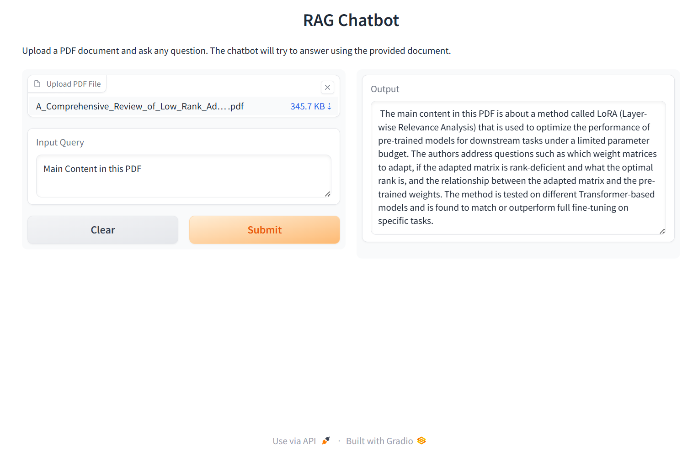

  

### This project demonstrates how to build a Retrieval-Augmented Generation (RAG) application using LangChain, IBM WatsonX, and Gradio. The project was completed as part of Coursera's "Generative AI Applications with RAG and LangChain" course.

## 🚀 Features
- Load documents from multiple sources using LangChain loaders
- Apply advanced text splitting strategies for token optimization
- Generate embeddings using IBM WatsonX
- Store and retrieve vectors using ChromaDB
- Implement a semantic retriever for contextual chunk retrieval
- Build a QA bot using LangChain + LLM
- Deploy an interactive interface using Gradio

## 🛠️ Tech Stack

  
  
  
  
  

<strong>Interactive Document-Based QA System using Retrieval-Augmented Generation 🔍📄</strong>

## 🖼️ Screenshots
Below is the Screenshot for my Rag Chatbot.

